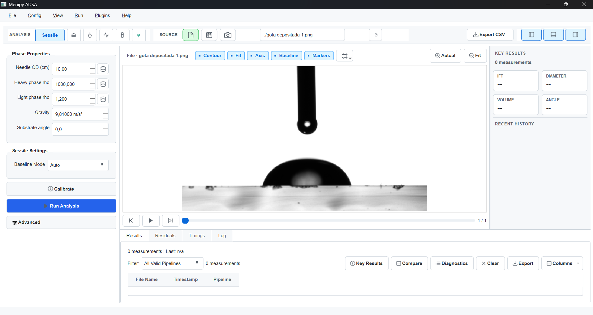

# Menipy

Menipy is an alpha-stage Python toolkit for droplet and meniscus shape analysis
from images. It provides a PySide6 graphical interface and a headless command
line tool for running analysis pipelines from files, cameras, or image
directories.

The project currently focuses on image-based workflows for sessile and pendant
drop analysis, with additional experimental pipelines under active development.

> [!WARNING]
> **Current intended use and known reliability issues:** Menipy began as an early
> exploration of how far a "vibe coding" workflow in Codex could take the
> project, and it is now moving toward a more deliberate stage with stronger
> human review, validation, and scientific scrutiny. At the moment, the project
> is meant mainly to explore image-processing techniques and to prototype a
> graphical workbench for work/science and educational software. It is not yet a
> reliable tool for production work or scientific measurements. In educational
> contexts it can be useful to show where the methods fail, but it should not be
> used as a trusted source of quantitative results. Fully automatic values for
> contact angle, surface tension, and contour detection can be inaccurate and
> should not be treated as definitive measurements. Even with manual selection,
> errors can still occur—for example, incorrect contact-point detection or
> incorrect droplet/meniscus contour detection below the substrate. These results
> should be reviewed critically and validated before using them for quantitative
> analysis.

## Goals

- Provide a clear, extensible foundation for droplet and meniscus shape analysis
  from images.
- Model analysis as pipelines where each step represents a concrete stage:
  loading, preprocessing, segmentation, contour extraction, geometry fitting,
  metrics, validation, and reporting.
- Support both GUI-driven exploration and headless CLI workflows for automated
  or batch processing.
- Grow a toolbox of measurements, numerical methods, plugins, and utilities
  beyond the most common droplet-analysis metrics.
- Keep the project accessible for scientific review by documenting assumptions,
  limitations, result contracts, and implementation details.



Screenshot: Menipy GUI with image preview, analysis controls, overlays, and
results panels.

## Status and Disclaimer

Menipy is an alpha-stage project under active development and is not
production-ready. Most of the implemented methods have not yet been tested or
validated against standard measurement methods, so results may be incorrect or
inaccurate. This software is not intended to replace validated commercial or
non-commercial measurement tools. Use it at your own risk and verify
measurements independently before relying on them.

Documentation and references may also contain errors because parts of them
were generated with AI assistance. They require human curation and should be
independently checked before being relied upon.

Package metadata also marks the project as alpha.

## Install

Menipy requires Python 3.10 or newer.

For local development or testing from a source checkout, `uv` is the
preferred method:

```bash
uv sync --extra dev --extra test
```

Run commands in the managed environment with `uv run`, for example:

```bash
uv run menipy
uv run adsa --help
```

As an alternative, install with Python's built-in virtual environment and pip:

```bash
python -m venv .venv
source .venv/bin/activate
python -m pip install --upgrade pip
pip install -e ".[dev,test]"
```

For a basic editable install without development tools:

```bash
pip install -e .
```

On Windows PowerShell, activate the virtual environment with:

```powershell
.\.venv\Scripts\Activate.ps1
```

## Launch

After installation, start the GUI with:

```bash
menipy
```

Fallback module entry point:

```bash
python -m menipy.gui.app
```

Run the command-line interface with:

```bash
adsa --help
```

## CLI Quick Examples

Single-image sessile analysis with auto-calibration:

```bash
adsa --pipeline sessile --image "data/samples/prueba sesil 2.png" --auto-calibrate --out ./out
```

Batch analysis of a directory:

```bash
adsa --pipeline sessile --input-dir data/samples --glob "*.png" --auto-calibrate --out ./out
```

The CLI also supports `--camera`, manual geometry options such as `--roi`,
`--needle`, and `--contact-line`, SOP loading with `--sop`, and plugin database
management through the `plugins` subcommand.

## Supported Analysis Modes

The current pipeline registry exposes these modes:

- `sessile`
- `pendant`
- `oscillating`
- `capillary_rise`
- `captive_bubble`

Sessile and pendant workflows are the primary documented user paths. Other
pipelines are present for ongoing development and should be treated as
experimental unless validated for your use case.

## Where to Go Next

- User guide: [DOCUMENTATION.md](DOCUMENTATION.md)
- Drop analysis workflow: [docs/guides/drop_analysis.md](docs/guides/drop_analysis.md)
- Image processing notes: [docs/guides/image_processing.md](docs/guides/image_processing.md)
- Scientific background: [docs/guides/base_information.md](docs/guides/base_information.md), [docs/guides/physics_models.md](docs/guides/physics_models.md), [docs/guides/numerical_methods.md](docs/guides/numerical_methods.md)
- Developer guides: [pipelines](docs/guides/developer_guide_pipelines.md), [plugins](docs/guides/developer_guide_plugins.md), [utilities](docs/guides/developer_guide_utilities.md)
- Result contracts: [docs/contracts/](docs/contracts/)
- Roadmap: [PLAN.md](PLAN.md)
- Contributing: [CONTRIBUTING.md](CONTRIBUTING.md)

Historical cleanup notes and archived planning material are preserved under
[archive/2026-05-cleanup/](archive/2026-05-cleanup/).

## Maintainer

Maintainer: Carlos Renaudo, PLAPIQUI - Planta Piloto de Ingenieria Quimica,
Universidad Nacional del Sur/CONICET.
