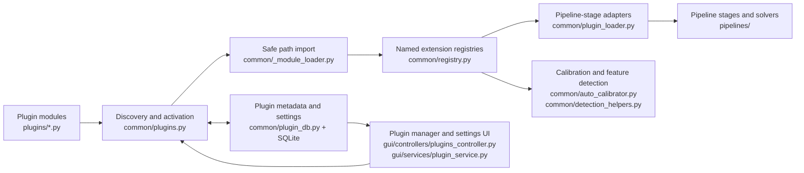

# Menipy Codebase Map

This is the curated navigation map for contributors and coding agents. It
describes stable ownership and execution flow; it is not a complete import
inventory. Start here, then open the smallest relevant implementation area and
its nearest tests.

## Execution graph

```mermaid
flowchart LR
    Scripts["pyproject.toml console entry points"]
    GUIEntry["GUI entry<br/>src/menipy/gui/app.py"]
    CLIEntry["CLI entry<br/>src/menipy/cli/__init__.py"]
    Window["Main window and views<br/>src/menipy/gui/views/"]
    MainController["GUI orchestration<br/>controllers/main_controller.py"]
    PipelineController["Run configuration and result routing<br/>controllers/pipeline_controller.py"]
    GUIRunner["Background Qt execution<br/>gui/services/pipeline_runner.py"]
    CoreRunner["Headless execution<br/>pipelines/runner.py"]
    Discovery["Pipeline discovery<br/>pipelines/discover.py"]
    Base["Stage plan and lifecycle<br/>pipelines/base.py"]
    Pipelines["Mode implementations<br/>pipelines/*/stages.py"]
    Context["Shared run state<br/>models/context.py"]
    Settings["Configuration models<br/>models/config.py"]
    Shared["Algorithms and services<br/>common/ + math/"]
    Results["Result models and contracts<br/>models/result*.py + docs/contracts/"]
    Presentation["Preview, overlays, history, exports<br/>gui/views/ + viz/"]

    Scripts -->|menipy| GUIEntry
    Scripts -->|adsa / menipy-cli| CLIEntry
    GUIEntry --> Window --> MainController --> PipelineController --> GUIRunner
    CLIEntry --> CoreRunner
    GUIRunner --> Discovery
    CoreRunner --> Discovery
    Discovery --> Base --> Pipelines
    Settings --> Base
    Pipelines <--> Context
    Pipelines --> Shared
    Shared --> Context
    Context --> Results --> Presentation
    PipelineController --> Presentation
```

The GUI and CLI share the core pipeline model but use different execution
adapters. The GUI service runs work through Qt's thread pool and emits results
back to controllers. The headless runner resolves a class from `PIPELINE_MAP`
and runs it directly. Pipeline stages exchange data through the Pydantic
`Context` model.

## Plugin graph

Plugin files are external extension points, not ordinary imports. Static import
graphs therefore under-report their runtime relationships. Trace plugin tasks
through discovery, database activation, module loading, registration, and the
consumer that requests a named implementation.

## Directory ownership

| Location | Responsibility | Start here |
| --- | --- | --- |
| `src/menipy/cli/` | Headless single-image, batch, camera, SOP, and plugin CLI workflows | `src/menipy/cli/__init__.py` |
| `src/menipy/gui/` | PySide6 application, controllers, dialogs, services, views, and resources | `src/menipy/gui/app.py`, `src/menipy/gui/controllers/main_controller.py` |
| `src/menipy/pipelines/` | Pipeline lifecycle, discovery, runner, and analysis-mode stages | `src/menipy/pipelines/base.py`, `src/menipy/pipelines/discover.py` |
| `src/menipy/common/` | Shared acquisition, detection, preprocessing, geometry, plugins, material data, units, and validation | Open the module named by the pipeline stage or controller |
| `src/menipy/models/` | Pydantic settings, shared context, geometry, fit, frame, state, and result data | `src/menipy/models/context.py`, `src/menipy/models/config.py` |
| `src/menipy/math/` | Reusable scientific equations and numerical models | `src/menipy/math/young_laplace.py` |
| `src/menipy/viz/` | Non-Qt plotting helpers | `src/menipy/viz/plots.py` |
| `plugins/` | Runtime-discovered algorithms and detectors | Match the filename to the registry kind in `src/menipy/common/registry.py` |
| `tests/` | Behavioral and architectural coverage | Start with the test whose name matches the subsystem |
| `docs/guides/` | Scientific, pipeline, plugin, GUI, and development explanations | `docs/guides/developer_guide_pipelines.md` |
| `docs/contracts/` | Pipeline results and results-panel integration contracts | Open the contract for the affected pipeline |
| `scripts/` | Import analysis, documentation generation, legacy analysis, and standalone diagnostics | Treat outputs as reports, not application state |
| `tools/` | Resource building, audits, migrations, and maintenance helpers | Read the tool module docstring before running it |
| `.github/workflows/` | Test, lint, pre-commit, and Qt resource CI | `.github/workflows/ci.yml`, `.github/workflows/lint.yml` |

## Task-to-file routes

| Task | Implementation route | Primary tests or contracts |
| --- | --- | --- |
| Change application startup or global Qt setup | `src/menipy/gui/app.py` -> `src/menipy/gui/views/main_window.py` -> `src/menipy/gui/controllers/main_controller.py` | `tests/test_gui_startup_preview.py`, `tests/test_import_health.py` |
| Change GUI workflow wiring or analysis execution | `src/menipy/gui/controllers/main_controller.py` -> `src/menipy/gui/controllers/pipeline_controller.py` -> `src/menipy/gui/services/pipeline_runner.py` | `tests/test_smoke_controller_flows.py`, `tests/test_pipeline_runner.py`, `tests/test_guided_ui_simplification.py` |
| Change preview, overlays, or result history | `src/menipy/gui/views/preview_panel.py`, `src/menipy/gui/views/results_panel.py`, `src/menipy/gui/controllers/overlay_manager.py` | `tests/test_preview_overlay_layers.py`, `tests/test_results_panel_history.py`, `docs/contracts/results_panel_integration.md` |
| Change CLI arguments, batch execution, or exports | `src/menipy/cli/__init__.py` -> `src/menipy/pipelines/runner.py` | `tests/test_cli.py`, the affected pipeline contract |
| Change the stage lifecycle or stage selection | `src/menipy/pipelines/base.py` -> `src/menipy/pipelines/discover.py` -> `src/menipy/pipelines/runner.py` | `tests/test_pipeline_runner.py`, `tests/test_alt_workflow.py` |
| Change a specific analysis mode | `src/menipy/pipelines/<mode>/stages.py` and sibling mode modules | `tests/test_<mode>*.py`, `docs/contracts/<mode>_results.md` when present |
| Change sessile contour or contact-angle behavior | `src/menipy/common/sessile_detection.py` -> `src/menipy/pipelines/sessile/geometry.py` -> `src/menipy/pipelines/sessile/stages.py` | `tests/test_sessile_auto_detection.py`, `tests/test_sessile_geometry.py`, `tests/test_sessile_contact_angles.py` |
| Change pendant fitting or surface tension | `src/menipy/pipelines/pendant/` -> `src/menipy/math/young_laplace.py` | `tests/test_pendant_pipeline.py`, `tests/test_surface_tension.py`, `tests/test_young_laplace_ode.py`, `docs/contracts/pendant_results.md` |
| Change calibration or automatic feature detection | `src/menipy/common/auto_calibrator.py`, `src/menipy/common/detection_helpers.py`, detector modules in `plugins/` | `tests/test_auto_calibrator.py`, `tests/test_detection_plugins.py` |
| Change shared run data or settings | `src/menipy/models/context.py`, `src/menipy/models/config.py`, then every stage/controller that reads the field | `tests/test_models.py`, pipeline and controller tests using the field |
| Add or modify a plugin kind | `src/menipy/common/registry.py` -> `src/menipy/common/plugins.py` -> `src/menipy/common/plugin_loader.py` -> matching `plugins/*.py` | `tests/test_plugin_consolidation.py`, `tests/test_detection_plugins.py`, `docs/guides/developer_guide_plugins.md` |
| Change material or needle database behavior | `src/menipy/common/material_db.py` -> `src/menipy/gui/services/material_catalog_service.py` -> setup/dialog controllers | `tests/test_setup_panel.py`, `tests/test_guided_ui_simplification.py` |
| Change Qt icons or compiled resources | `src/menipy/gui/resources/` -> `tools/build_resources.py` -> GUI consumers | `tests/test_gui_resources.py`, `.github/workflows/build-gui-resources.yml` |
| Change packaging, lint, types, or test configuration | `pyproject.toml`, `.pre-commit-config.yaml`, `.github/workflows/` | Run the corresponding local command and relevant workflow-equivalent tests |

`<mode>` means one of the directories currently discovered under
`src/menipy/pipelines/`: `sessile`, `pendant`, `oscillating`, `capillary_rise`,
or `captive_bubble`.

## Tooling and generated information

The maintenance tools are useful for investigation, but their outputs do not
override current source, tests, or documentation.

- Import analysis: `tests/test_import_map.py` writes
  `build/menipy_import_map.json`; `scripts/generate_graph.py` can turn it into
  DOT/PNG output. `scripts/import_all_menipy.py`, `scripts/merge_import_maps.py`,
  and `scripts/generate_recommendations.py` add runtime-import and orphan reports.
- Documentation: `scripts/generate_docs.py` and Sphinx configuration under
  `docs/` generate documentation output.
- Maintenance: `tools/audit_docstrings.py`, `tools/build_resources.py`, and
  migration/remediation helpers operate on the repository but are not runtime
  dependencies.
- CI: `.github/workflows/ci.yml` runs tests and package builds;
  `.github/workflows/lint.yml` runs Black, isort, Ruff, and mypy;
  `.github/workflows/pre-commit.yml` runs the repository hooks.

Generated files under `build/`, `dist/`, `out/`, coverage output, caches, and
rendered graphs are disposable evidence. `archive/2026-05-cleanup/` records past
cleanup work and can explain history, but it must not be used as the current
architecture contract.

## Dependency hotspots

Use extra care when changing these files because they connect many subsystems:

- `src/menipy/models/context.py`: shared state contract across all stages.
- `src/menipy/models/config.py`: common GUI, CLI, and pipeline settings.
- `src/menipy/pipelines/base.py`: canonical stage order and compatibility aliases.
- `src/menipy/gui/views/main_window.py`: large composition root for GUI widgets.
- `src/menipy/gui/controllers/pipeline_controller.py`: translates GUI state into
  runs and translates contexts back into UI state.
- `src/menipy/common/registry.py`: public namespace for runtime extensions.

For a hotspot change, identify readers and writers of the affected field or
signal, then run the focused tests for both sides of the boundary.

## Navigation order

1. Find the task in the routing table above.
2. Read the listed entry file and its direct collaborators, not the whole tree.
3. Read the focused tests and any result contract before editing.
4. Follow data through `Context` for pipeline work and Qt signals for GUI work.
5. Consult the generated import map only when static dependency reach is still
   unclear; account for dynamic pipeline and plugin loading separately.

Update this map when a stable route or ownership boundary changes. Do not add
every new leaf module: add information only when it changes how a contributor
finds or safely modifies behavior.
