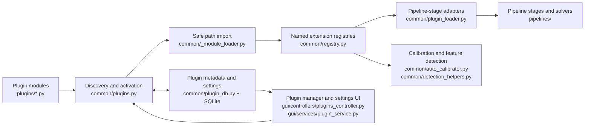

# Menipy Codebase Map

This is the curated navigation map for contributors and coding agents. It
describes stable ownership and execution flow; it is not a complete import
inventory. Start here, then open the smallest relevant implementation area and
its nearest tests.

## Execution graph

```mermaid
flowchart LR
    Scripts["pyproject.toml console entry points"]
    GUIEntry["GUI entry<br/>src/menipy/gui/app.py"]
    CLIEntry["CLI entry<br/>src/menipy/cli/__init__.py"]
    Window["Main window and views<br/>src/menipy/gui/views/"]
    MainController["GUI orchestration<br/>controllers/main_controller.py"]
    PipelineController["Run configuration and result routing<br/>controllers/pipeline_controller.py"]
    GUIRunner["Background Qt execution<br/>gui/services/pipeline_runner.py"]
    CoreRunner["Headless execution<br/>pipelines/runner.py"]
    Discovery["Pipeline discovery<br/>pipelines/discover.py"]
    Base["Stage plan and lifecycle<br/>pipelines/base.py"]
    Pipelines["Static and temporal mode implementations<br/>pipelines/*/stages.py"]
    Context["Shared run state<br/>models/context.py"]
    Settings["Configuration models<br/>models/config.py"]
    Shared["Algorithms and services<br/>common/ + math/"]
    Results["Result models and contracts<br/>models/result*.py + docs/contracts/"]
    Presentation["Preview, overlays, history, exports<br/>gui/views/ + viz/"]

    Scripts -->|menipy| GUIEntry
    Scripts -->|adsa / menipy-cli| CLIEntry
    GUIEntry --> Window --> MainController --> PipelineController --> GUIRunner
    CLIEntry --> CoreRunner
    GUIRunner --> Discovery
    CoreRunner --> Discovery
    Discovery --> Base --> Pipelines
    Settings --> Base
    Pipelines <--> Context
    Pipelines --> Shared
    Shared --> Context
    Context --> Results --> Presentation
    PipelineController --> Presentation
```

The GUI and CLI share the core pipeline model but use different execution
adapters. The GUI service runs work through Qt's thread pool and emits results
back to controllers. The headless runner resolves a class from `PIPELINE_MAP`
and runs it directly. Pipeline stages exchange data through the Pydantic
`Context` model. The GUI owns a single-operation thread pool and routes full
request/completion envelopes through its view model; calibration and preview
computations use the same lifecycle. See [GUI execution](guides/gui_execution.md)
for cancellation, stale-result handling, and isolated regression commands.
The primary GUI selector exposes `sessile_dynamic` video/frame sequences.
Independent-image folders use `gui/controllers/folder_controller.py` and
`gui/services/folder_execution.py` to stream per-file outcomes through the same
window pool; CLI temporal tracking remains in the CLI adapter.
`models/results.py` owns atomic history writes and retry/recovery state.
`models/calibration.py` defines calibration provenance; GUI execution annotates
contexts through `gui/services/calibration_provenance.py` before persistence.
See [history recovery and calibration](guides/history_recovery_calibration.md)
and `tests/test_history_recovery_calibration.py` for publication and fault tests.
Versioned analysis presets use `models/preset.py` and
`gui/controllers/preset_controller.py`, stored through the existing SOP service.
`readiness_controller.py` owns source readiness, calibration invalidation and
accessible workflow labels. See [presets and workflow UX](guides/presets_workflow_ux.md),
`tests/test_presets_readiness_layout.py`, and `tools/smoke_presets_layout.py`.
File-backed dynamic acquisition uses `models/frame_store.py` and the excluded
`Context.sequence_store`; acquisition and pipeline cleanup own its lifetime.
Canonical history CSV lives in `models/results.py`, while the results panel owns
the display export. Worker provenance uses `common/runtime_provenance.py`.
See [sequence memory, profiling and exports](guides/sequence_memory_profiling_exports.md),
`tests/test_sequence_storage_exports.py`, and `tools/profile_analysis.py`.
Workspace preferences use `gui/services/workspace_preferences.py` and
`gui/dialogs/settings_dialog.py`; retention archives remain in `models/results.py`.
See [workspace preferences and retention](guides/workspace_preferences_retention.md),
`tests/test_workspace_preferences.py`, and `tools/profile_history.py` for behavior
and table-scaling measurements.
Pendant fit-local shape reuse is described in
[numerical optimization](guides/numerical_optimization.md), with exact-equivalence
tests in `tests/test_pendant_fit_cache.py` and paired timing in
`tools/profile_pendant_cache.py`.
Deterministic pendant table persistence lives in `pipelines/pendant/lookup_cache.py`;
`tests/test_lookup_cache.py` checks invalidation/faults and
`tools/profile_lookup_cache.py` measures fresh-process reuse.
First-ever table generation reuses exact ODE derivatives within each beta sweep;
`tests/test_lookup_derivative_reuse.py` checks complete table/profile equivalence,
bounds and cancellation. `tools/profile_cold_lookup_build.py` measures uncached
builds; `tools/profile_lookup_rhs.py` audits exact derivative overlap.
Fixed observation preparation in `common/solver.py` and seven-index temporal
windows in `common/temporal_sessile.py` are checked by
`tests/test_numerical_repeated_work.py`; `tools/profile_repeated_work.py` measures
their paired timings.
Bounded temporal bootstrap sampling is covered by `tests/test_bootstrap_batches.py`;
`tools/profile_bootstrap_batches.py` measures allocation and timing equivalence.
Stable pendant envelope grouping is checked in `tests/test_pendant_envelope_grouping.py`;
`tools/profile_pendant_envelope.py` compares construction times and exact outputs.
Strict ODE callback reuse is covered by `tests/test_ode_callback_reuse.py`;
`tools/profile_ode_reuse.py` measures integration and complete-fit timings.
Exact temporal regression convergence is covered by `tests/test_robust_slope_convergence.py`;
`tools/profile_slope_convergence.py` measures complete classification timings.
Straight-baseline crossing selection in `common/geometry.py` is checked by
`tests/test_contact_crossing_selection.py`; `tools/profile_contact_crossings.py`
measures contact-detection timings.
Shared sessile/pendant ODE invariant calculations are checked by
`tests/test_ode_invariants.py`; `tools/profile_ode_invariants.py` measures
integration and synthetic fitting workflows.
Scalar adjacent-velocity medians are checked by `tests/test_adjacent_velocity.py`;
`tools/profile_adjacent_velocity.py` measures full temporal classification.
Pendant multi-plane profile preparation is checked by
`tests/test_multi_plane_preparation.py`; `tools/profile_multi_plane_preparation.py`
measures warmed multi-plane estimation.
Combined bootstrap percentiles are checked by `tests/test_bootstrap_percentiles.py`;
`tools/profile_bootstrap_percentiles.py` measures complete bootstrap timings.
Sessile clipping-mask reuse is covered by `tests/test_clip_mask_reuse.py`;
`tools/profile_clip_mask.py` measures clipping with exact geometry comparisons.
`tools/profile_solver_reuse.py` audits exact repeated integration requests before
adding numerical caches; it does not change application execution.
Bounded active-contour matrix reuse lives in `math/active_contour.py`, with
`tests/test_snake_matrix_cache.py` and `tools/profile_snake_matrix.py` covering
exact evolution and warmed full-snake timing.
Shared line/flux gradient sampling is covered by `tests/test_snake_force_reuse.py`
and `tools/profile_snake_forces.py`, including default-setting timing controls.
Deferred iteration curvature in the same solver is checked by
`tests/test_snake_geometry_work.py`; `tools/profile_snake_geometry.py` measures
complete evolution while preserving final geometry and convergence.
Conditional iteration normals are covered by `tests/test_snake_normal_skip.py`
and `tools/profile_snake_normals.py`; final output geometry remains complete.
Single-image sessile/pendant profiling uses `tools/profile_single_image_state.py`;
`tests/test_ode_state_access.py` and its frozen `tests/ode_state_reference.py`
check direct pendant ODE state access against unchanged adaptive profiles/events.
Single-run needle-row detection in `common/sessile_detection.py` is verified by
`tests/test_needle_single_run.py`; `tools/profile_single_image_calibration.py`
compares complete sessile and pendant auto-calibration outputs and timings.
Run-local shaft detection reuse between needle and fallback-mask steps is checked
by `tests/test_calibration_shaft_reuse.py` and measured by
`tools/profile_calibration_shaft_reuse.py`.

## Plugin graph

Calibration display boundaries are separated from measured contours by
`common/liquid_boundary.py` and `CalibrationResult.liquid_boundary`. See
[liquid boundary](guides/liquid_boundary.md), `tests/test_liquid_boundary.py`,
and `tools/preview_liquid_boundary.py` for geometry and offscreen visual checks.
`LiquidGeometry` is the authoritative apex-side surface/contact contract for
straight boundaries; raw contours remain detector evidence. See
`tests/test_liquid_geometry_contract.py` for tilted-line and crossing coverage.

```mermaid
flowchart LR
    PluginFiles["Plugin modules<br/>plugins/*.py"]
    Discovery["Discovery and activation<br/>common/plugins.py"]
    Database["Plugin metadata and settings<br/>common/plugin_db.py + SQLite"]
    ModuleLoader["Safe path import<br/>common/_module_loader.py"]
    Registration["Named extension registries<br/>common/registry.py"]
    StageLoader["Pipeline-stage adapters<br/>common/plugin_loader.py"]
    PipelineConsumers["Pipeline stages and solvers<br/>pipelines/"]
    DetectionConsumers["Calibration and feature detection<br/>common/auto_calibrator.py<br/>common/detection_helpers.py"]
    GUIConsumers["Plugin manager and settings UI<br/>gui/controllers/plugins_controller.py<br/>gui/services/plugin_service.py"]

    PluginFiles --> Discovery
    Discovery <--> Database
    Discovery --> ModuleLoader --> Registration
    Registration --> StageLoader --> PipelineConsumers
    Registration --> DetectionConsumers
    Database --> GUIConsumers
    GUIConsumers --> Discovery
```

Plugin files are external extension points, not ordinary imports. Static import
graphs therefore under-report their runtime relationships. Trace plugin tasks
through discovery, database activation, module loading, registration, and the
consumer that requests a named implementation.

## Directory ownership

| Location | Responsibility | Start here |
| --- | --- | --- |
| `src/menipy/cli/` | Headless single-image, batch, camera, SOP, and plugin CLI workflows | `src/menipy/cli/__init__.py` |
| `src/menipy/gui/` | PySide6 application, controllers, dialogs, services, views, and resources | `src/menipy/gui/app.py`, `src/menipy/gui/controllers/main_controller.py` |
| `src/menipy/pipelines/` | Pipeline lifecycle, discovery, runner, and analysis-mode stages | `src/menipy/pipelines/base.py`, `src/menipy/pipelines/discover.py` |
| `src/menipy/common/` | Shared acquisition, detection, preprocessing, geometry, plugins, material data, units, and validation | Open the module named by the pipeline stage or controller |
| `models/mobilesam/` | Versioned ONNX-only MobileSAM TinyViT encoder and prompt/mask decoder | `models/mobilesam/README.md`, `src/menipy/common/mobilesam_onnx.py` |
| `src/menipy/models/` | Pydantic settings, shared context, geometry, fit, frame, state, and result data | `src/menipy/models/context.py`, `src/menipy/models/config.py` |
| `src/menipy/math/` | Reusable scientific equations and numerical models | `src/menipy/math/young_laplace.py`, `src/menipy/math/lbadsa.py`, `src/menipy/math/rheology.py`, `src/menipy/math/hydrodynamics.py`, `src/menipy/math/jurin.py`, `src/menipy/math/apex.py` |
| `src/menipy/viz/` | Non-Qt plotting helpers | `src/menipy/viz/plots.py` |
| `plugins/` | Runtime-discovered algorithms and detectors | Match the filename to the registry kind in `src/menipy/common/registry.py` |
| `tests/` | Behavioral and architectural coverage | Start with the test whose name matches the subsystem |
| `docs/guides/` | Scientific, pipeline, plugin, GUI, and development explanations | `docs/guides/numerical_methods.md`, `docs/guides/physics_models.md`, `docs/guides/developer_guide_pipelines.md`, `docs/guides/llm_coding_agent_guide.md` |
| `docs/contracts/` | Pipeline results and results-panel integration contracts | Open the contract for the affected pipeline |
| `docs/research/` | Reproducible research plans and evidence-backed external-method assessments | `docs/research/adsa_open_source_evaluation_plan.md` |
| `scripts/` | Import analysis, documentation generation, legacy analysis, and standalone diagnostics | Treat outputs as reports, not application state |
| `tools/` | Resource building, audits, migrations, and maintenance helpers | Read the tool module docstring before running it |
| `.github/workflows/` | Test, lint, pre-commit, and Qt resource CI | `.github/workflows/ci.yml`, `.github/workflows/lint.yml` |

## Task-to-file routes

| Task | Implementation route | Primary tests or contracts |
| --- | --- | --- |
| Change application startup or global Qt setup | `src/menipy/gui/app.py` -> `src/menipy/gui/views/main_window.py` -> `src/menipy/gui/controllers/main_controller.py` | `tests/test_gui_startup_preview.py`, `tests/test_import_health.py` |
| Change GUI workflow wiring or analysis execution | `src/menipy/gui/controllers/main_controller.py` -> `src/menipy/gui/controllers/pipeline_controller.py` -> `src/menipy/gui/services/pipeline_runner.py` | `tests/test_smoke_controller_flows.py`, `tests/test_pipeline_runner.py`, `tests/test_guided_ui_simplification.py` |
| Change preview, overlays, or result history | `src/menipy/gui/views/preview_panel.py`, `src/menipy/gui/views/results_panel.py`, `src/menipy/gui/controllers/overlay_manager.py` | `tests/test_preview_overlay_layers.py`, `tests/test_results_panel_history.py`, `docs/contracts/results_panel_integration.md` |
| Change CLI arguments, batch execution, or exports | `src/menipy/cli/__init__.py` -> `src/menipy/pipelines/runner.py` | `tests/test_cli.py`, the affected pipeline contract |
| Change the stage lifecycle or stage selection | `src/menipy/pipelines/base.py` -> `src/menipy/pipelines/discover.py` -> `src/menipy/pipelines/runner.py` | `tests/test_pipeline_runner.py`, `tests/test_alt_workflow.py` |
| Change a specific analysis mode | `src/menipy/pipelines/<mode>/stages.py` and sibling mode modules | `tests/test_<mode>*.py`, `docs/contracts/<mode>_results.md` when present |
| Change dynamic sessile tracking, video timing, hysteresis, hydrodynamic extrapolation, or timeline exports | `src/menipy/common/sequence_acquisition.py` -> `src/menipy/common/temporal_sessile.py` -> `src/menipy/math/hydrodynamics.py` -> `src/menipy/pipelines/sessile_dynamic/` | `tests/test_phase_d_dynamic_sessile.py`, `tests/test_hydrodynamics.py`, `tests/data/adsa_temporal_manifest.json`, `docs/contracts/sessile_dynamic_results.md` |
| Change oscillating dilational rheology or Rayleigh-Lamb tension | `src/menipy/math/rheology.py` -> `src/menipy/pipelines/oscillating/` | `tests/test_oscillating_pipeline.py`, `docs/contracts/oscillating_results.md` |
| Change capillary rise or captive bubble physics | `src/menipy/math/jurin.py` -> `src/menipy/pipelines/capillary_rise/` -> `src/menipy/pipelines/captive_bubble/` | `tests/test_capillary_rise_pipeline.py`, `tests/test_captive_bubble.py` |
| Change solid surface free energy (OWRK / Wu) or probe liquid library | `src/menipy/common/liquid_db.py` -> `src/menipy/math/surface_energy.py` -> `src/menipy/pipelines/surface_energy/` -> `src/menipy/viz/owrk_plot.py` | `tests/test_liquid_db.py`, `tests/test_surface_energy.py`, `tests/test_sfe_cli.py`, `docs/contracts/surface_energy_results.md`, `docs/guides/probe_liquid_reference.md` |
| Change needle-in-sessile-drop contact angle hysteresis | `src/menipy/common/needle_drop_detection.py` -> `src/menipy/math/needle_profile_fit.py` -> `src/menipy/common/needle_hysteresis.py` -> `src/menipy/pipelines/needle_hysteresis/` | `tests/test_needle_profile_fit.py`, `tests/test_needle_hysteresis.py`, `tests/test_needle_hysteresis_cli.py`, `docs/contracts/needle_hysteresis_results.md` |
| Change sub-pixel edge detection or curvilinear profiling | `plugins/auto_subpixel_edge.py` -> `src/menipy/common/registry.py` | `tests/test_subpixel_edge_plugin.py` |
| Change sessile contour or contact-angle behavior | `src/menipy/common/sessile_detection.py` -> `src/menipy/common/geometry.py` -> `src/menipy/pipelines/sessile/` | `tests/test_sessile_auto_detection.py`, `tests/test_sessile_geometry.py`, `tests/test_sessile_contact_angles.py`, `docs/guides/contact_angle_geometry.md` |
| Change the arc/clothoid spline contact angles (`arc_spline`, `clothoid_spline`), their Young-Laplace box prior, or image refinement | `src/menipy/math/sessile_box.py` -> `src/menipy/common/arc_spline.py` (shared frame, apex, refinement) -> `src/menipy/common/clothoid_spline.py` -> `src/menipy/pipelines/sessile/metrics.py` | `tests/test_arc_spline.py`, `tests/test_clothoid_spline.py`, `tests/test_sessile_box.py`, `tests/synthetic_sessile.py`, `docs/research/arc_spline_contour.md`; measure with `tools/profile_arc_spline.py`, `tools/compare_arc_spline_samples.py`, `scripts/benchmark_arc_spline.py`, `scripts/pendant_zones_study.py` |
| Change the pendant two-zone clothoid spline (surface tension, `clothoid_zones` contour model, needle angle) | `src/menipy/math/pendant_box.py` (anchored Young-Laplace table, golden-section Bond) -> `src/menipy/common/pendant_spline.py` (zone layout, symmetry axis, contact slide, image refinement; reuses `clothoid_spline._Problem`) -> `src/menipy/pipelines/pendant/zone_spline.py` (pipeline glue, approximator) -> `src/menipy/pipelines/pendant/stages.py` | `tests/test_pendant_spline.py`, `tests/synthetic_pendant.py`, `scripts/benchmark_pendant_spline.py`, `docs/research/arc_spline_contour.md`, `docs/contracts/pendant_results.md` |
| Change Low-Bond ADSA (LB-ADSA) perturbation math or solver | `src/menipy/math/lbadsa.py` -> `src/menipy/common/lbadsa_solver.py` -> `src/menipy/pipelines/sessile/` | `tests/test_lbadsa.py`, `docs/contact_angle_methods.md`, `docs/guides/physics_models.md` |
| Change curved substrate baselines, arc drawing, or slope correction | `src/menipy/models/geometry.py` -> `src/menipy/common/sessile_detection.py` -> `src/menipy/pipelines/sessile/` | `tests/test_curved_substrate.py`, `tests/test_substrate_detection_robust.py`, `docs/guides/curved_substrates_and_baseline_detection.md` |
| Fetch or verify academic benchmark datasets and author attribution | `data/MANIFEST.json`, `data/ATTRIBUTION.md` -> `tools/fetch_benchmarks.py` | `tests/test_benchmarks.py`, `data/ATTRIBUTION.md` |
| Change pendant fitting, surface tension, or Phase-B axis initialization | `src/menipy/pipelines/pendant/` -> `src/menipy/math/young_laplace.py` -> `src/menipy/common/geometry_prototypes.py` | `tests/test_pendant_pipeline.py`, `tests/test_adsa_geometry_phase_b.py`, `docs/contracts/pendant_results.md` |
| Change calibration or automatic feature detection | `src/menipy/common/auto_calibrator.py`, `src/menipy/common/detection_helpers.py`, detector modules in `plugins/` | `tests/test_auto_calibrator.py`, `tests/test_detection_plugins.py` |
| Change droplet apex detection, flat crest averaging, normal projection, or sub-pixel polynomial refinement | `src/menipy/math/apex.py` -> `plugins/detect_apex.py` -> `src/menipy/pipelines/<mode>/stages.py` | `tests/test_apex_detection.py`, `tests/test_detection_plugins.py` |
| Change ADSA diagnostics, rejection, or detector conformance | `src/menipy/common/validation.py` -> `src/menipy/models/results.py` -> results consumers | `tests/test_phase_a_diagnostics.py`, `tests/test_phase_a_results_gui.py`, `tests/test_adsa_detector_conformance.py` |
| Change MobileSAM inference or regenerate its ONNX graphs | `src/menipy/common/mobilesam_onnx.py` -> `models/mobilesam/`; build with `scripts/export_mobilesam_onnx.py` | `tests/test_mobilesam_onnx.py`, `models/mobilesam/README.md` |
| Change ONNX proposal providers or annotation datasets | `src/menipy/common/segmentation_providers.py` -> `src/menipy/common/onnx_shadow.py` -> `src/menipy/common/annotation_dataset.py` | `tests/test_phase_c_onnx_providers.py`, `docs/contracts/onnx_segmentation_providers.md`, `docs/contracts/adsa_annotation_dataset.md` |
| Change shared run data or settings | `src/menipy/models/context.py`, `src/menipy/models/config.py`, then every stage/controller that reads the field | `tests/test_models.py`, pipeline and controller tests using the field |
| Add or modify a plugin kind | `src/menipy/common/registry.py` -> `src/menipy/common/plugins.py` -> `src/menipy/common/plugin_loader.py` -> matching `plugins/*.py` | `tests/test_plugin_consolidation.py`, `tests/test_detection_plugins.py`, `docs/guides/developer_guide_plugins.md` |
| Change material or needle database behavior | `src/menipy/common/material_db.py` -> `src/menipy/gui/services/material_catalog_service.py` -> setup/dialog controllers | `tests/test_setup_panel.py`, `tests/test_guided_ui_simplification.py` |
| Change Qt icons or compiled resources | `src/menipy/gui/resources/` -> `tools/build_resources.py` -> GUI consumers | `tests/test_gui_resources.py`, `.github/workflows/build-gui-resources.yml` |
| Change packaging, lint, types, or test configuration | `pyproject.toml`, `.pre-commit-config.yaml`, `.github/workflows/` | Run the corresponding local command and relevant workflow-equivalent tests |
| Understand or update AI agent guidelines and workflows | `AGENTS.md`, `CLAUDE.md`, `GEMINI.md`, `.cursorrules` -> `docs/guides/llm_coding_agent_guide.md` | `docs/guides/llm_coding_agent_guide.md` |

`<mode>` means one of the directories currently discovered under
`src/menipy/pipelines/`: `sessile`, `sessile_dynamic`, `pendant`, `oscillating`,
`capillary_rise`, `captive_bubble`, `surface_energy`, or `needle_hysteresis`.

## Tooling and generated information

The maintenance tools are useful for investigation, but their outputs do not
override current source, tests, or documentation.

- Import analysis: `tests/test_import_map.py` writes
  `build/menipy_import_map.json`; `scripts/generate_graph.py` can turn it into
  DOT/PNG output. `scripts/import_all_menipy.py`, `scripts/merge_import_maps.py`,
  and `scripts/generate_recommendations.py` add runtime-import and orphan reports.
- Documentation: `scripts/generate_docs.py` and Sphinx configuration under
  `docs/` generate documentation output.
- ADSA detector conformance: `tests/data/adsa_detector_manifest.json` defines
  48 deterministic cases; `tests/adsa_conformance.py` generates them in memory,
  and `scripts/benchmark_adsa_phase_a.py` writes non-blocking performance evidence.
- Phase-B geometry conformance: `tests/data/adsa_geometry_manifest.json` defines
  60 deterministic cases; `tests/adsa_geometry_conformance.py` generates them
  in memory, and `scripts/benchmark_adsa_phase_b.py` writes non-blocking evidence.
- Phase-C ONNX proposals: `tests/test_phase_c_onnx_providers.py` blocks model
  integrity, topology, determinism, shadow invariance, and dataset review
  status; `scripts/benchmark_adsa_phase_c.py` writes non-blocking mask evidence.
- Phase-D temporal sessile: `tests/data/adsa_temporal_manifest.json` defines 48
  deterministic sequences; `tests/adsa_temporal_conformance.py` generates them
  without binary fixtures, and `scripts/benchmark_adsa_phase_d.py` exports the
  fast gate and full benchmark evidence.
- Maintenance: `tools/audit_docstrings.py`, `tools/build_resources.py`, and
  migration/remediation helpers operate on the repository but are not runtime
  dependencies.
- CI: `.github/workflows/ci.yml` runs tests and package builds;
  `.github/workflows/lint.yml` runs Black, isort, Ruff, and mypy;
  `.github/workflows/pre-commit.yml` runs the repository hooks.

Generated files under `build/`, `dist/`, `out/`, coverage output, caches, and
rendered graphs are disposable evidence. `archive/2026-05-cleanup/` records past
cleanup work and can explain history, but it must not be used as the current
architecture contract.

## Dependency hotspots

Use extra care when changing these files because they connect many subsystems:

- `src/menipy/models/context.py`: shared state contract across all stages.
- `src/menipy/models/config.py`: common GUI, CLI, and pipeline settings.
- `src/menipy/pipelines/base.py`: canonical stage order and compatibility aliases.
- `src/menipy/gui/views/main_window.py`: large composition root for GUI widgets.
- `src/menipy/gui/controllers/pipeline_controller.py`: translates GUI state into
  runs and translates contexts back into UI state.
- `src/menipy/common/registry.py`: public namespace for runtime extensions.

For a hotspot change, identify readers and writers of the affected field or
signal, then run the focused tests for both sides of the boundary.

## Navigation order

1. Find the task in the routing table above.
2. Read the listed entry file and its direct collaborators, not the whole tree.
3. Read the focused tests and any result contract before editing.
4. Follow data through `Context` for pipeline work and Qt signals for GUI work.
5. Consult the generated import map only when static dependency reach is still
   unclear; account for dynamic pipeline and plugin loading separately.

Update this map when a stable route or ownership boundary changes. Do not add
every new leaf module: add information only when it changes how a contributor
finds or safely modifies behavior.
